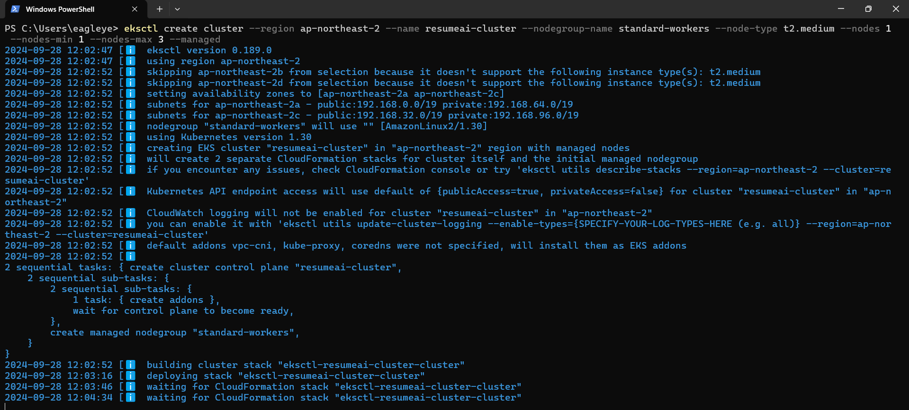
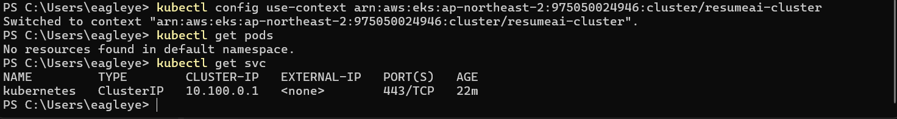
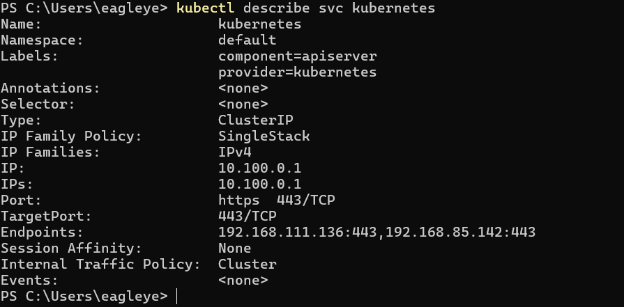
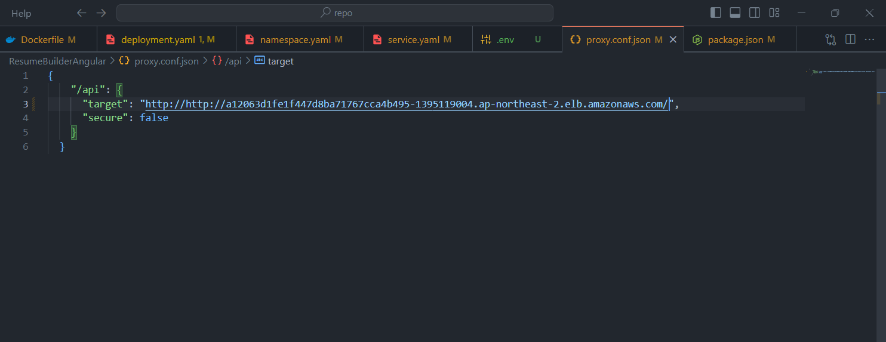
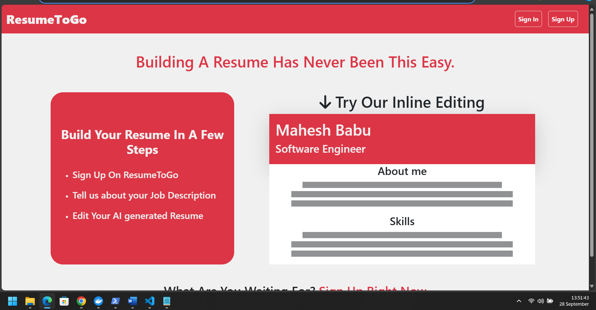

# ResumeAI
## Overview
This projects overviews on how to deploy MEAN Application using Kubernetes K8's

## Features
- Dockerfile for the application
- Docker Compose for multi-container orchestration
- CI/CD pipeline using Jenkins
- Deployment on local Minikube
- Deployment on AWS EKS

## Requirements
- Docker
- Docker Compose
- Jenkins
- Minikube
- AWS CLI
- kubectl

## Steps

- Create AWS Cluster using EKS
  

- Set cluster current context to created cluster

- Describe the cluster using the command

- Apply the kubernetes files and get load balancer of Backend and put it on url of Angular API route

- Now apply frontend as well now you would see this working

